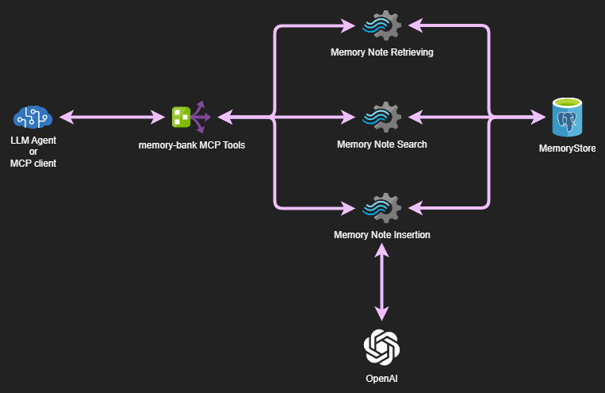

# 🧠 memory-bank-mcp

[](https://openjdk.org/projects/jdk/25/)
[](https://spring.io/projects/spring-boot)
[](https://github.com/langchain4j/langchain4j)
[](https://github.com/pgvector/pgvector)

[](https://opensource.org/licenses/Apache-2.0)


---

## 🧩 Tagline
> **A persistent, self-organizing memory bank for LLMs — powered by Zettelkasten and cognitive forgetting.**

---

## 🎯 Goal

`memory-bank-mcp` provides a **memory persistence layer** for Large Language Models using the **Zettelkasten note-taking method** as its core structure.  
It allows LLMs to **store, relate, and retrieve knowledge fragments** (“memory notes”) through semantic similarity and **retrievability decay**, emulating human long-term memory behavior.

---

## 🏗️ Architecture Overview



---

## ⚙️ Key Features

- 🧠 **Zettelkasten-based structure** — notes linked by semantic or conceptual relations.
- 🔗 **Link typing** — causal, contrast, example, derived concept, shared context, opposition.
- 🧮 **Retrievability decay** — simulates forgetting with exponential decay over time.
- 🔍 **Similarity search** — pgvector-powered embeddings using `all-MiniLM-L6-v2`.
- 🧰 **MCP endpoint interface** — simple and efficient communication via Server-Sent Events (SSE).
- 🚀 **Dockerized deployment** — ready to run anywhere.
- 🔄 **LLM-generated link explanations** — automatic reason generation for note relationships.

---

## 🧠 Memory Note Structure

Each **memory note** represents an atomic knowledge unit — a self-contained idea, observation, or statement — enriched with metadata for contextual retrieval and cognitive decay management.

| Field              | Type             | Description                                                                   |
| ------------------ | ---------------- | ----------------------------------------------------------------------------- |
| **id**             | UUID             | Unique identifier automatically assigned to each note.                        |
| **content**        | String           | The textual body of the note.                                                 |
| **vectorContent**  | float[384]       | Embedding vector used for similarity search (stored via pgvector).            |
| **keywords**       | List<String>     | Key concepts extracted from the content to improve recall.                    |
| **links**          | List<MemoryLink> | Connections to related notes, each with a type and LLM-generated explanation. |
| **context**        | String           | Optional contextual information (e.g., source, topic, or situation).          |
| **tags**           | List<String>     | User-defined labels for thematic grouping or filtering.                       |
| **timestamp**      | String           | Creation date and time of the note.                                           |
| **lastAccessed**   | long             | Unix timestamp (seconds) of the last retrieval.                               |
| **retrievalCount** | long             | Number of times this note has been accessed, used for retrievability decay.   |

### Link Types

The link types used in this system are inspired by [Collins & Quillian (1969)](https://doi.org/10.1016/S0022-5371(69)80069-1) and [Collins & Loftus (1975)](https://psycnet.apa.org/doi/10.1037/0033-295X.82.6.407), who modeled human semantic memory as a network of nodes connected by relationships such as *hierarchical inclusion* (ISA) and *associative links* between related concepts.
Building on this foundation, we define link types between notes to capture both classical semantic relations and extensions for conceptual reasoning, including contrastive and opposing relationships.

* **CAUSAL** — represents a cause–effect relation between concepts, similar to directional associative links in Collins’s framework.
* **CONTRAST** — denotes a conceptual or factual difference between notes. While not explicitly present in the original Collins model, it can be understood as a type of _associative relation with divergent meaning_, reflecting semantic distinctions learned from context or experience.
* **EXAMPLE** — provides an illustration or instance that supports or clarifies another note. This corresponds to Collins’s *instance-of* or hierarchical mapping of specific examples to categories.
* **DERIVED_CONCEPT** — indicates that a note abstracts or generalizes from another concept, extending Collins’s idea of property inheritance in hierarchies to derived or higher-order concepts.
* **SHARED_CONTEXT** — links notes that occur in the same thematic, situational, or domain context, an extension of associative links capturing co-occurrence in experience.
* **OPPOSITION** — marks a note that directly contradicts or refutes another. In Collins’s original model, negative or inhibitory links were not defined; in this system, opposition is represented as a _specialized associative link with negative polarity_, encoding a semantic conflict between concepts.

Each link includes a **source**, **destination**, **type**, and an **explanation**, which is automatically generated by the configured LLM.
This allows the network to maintain both the structural properties of classical semantic memory and the richer reasoning relationships required for knowledge representation.

---

## 🧩 Retrievability Model

Retrievability is inspired by [*“Two Components of Long-Term Memory”*](https://polona2.pl/item/two-components-of-long-term-memory,MTE2MDU1MDU/3/#info:metadata) and controls which notes remain accessible over time.

$$
R(t, i) = e^{t \cdot \log(K) / (c_1 \cdot c_2^{i-1})}
$$

Where:

* **t** = seconds since last retrieval
* **i** = retrieval count
* **K** = target probability for first interval
* **c₁** = duration (s) of first interval
* **c₂** = re-learning factor

Retrievability decays exponentially as time passes without access, allowing the system to **favor recently used or frequently recalled notes** while progressively lowering the visibility of stale ones — a process that acts as a **cognitive decay mechanism** rather than simple data removal.

### 🔍 Filter Types

Two filtering strategies can be applied to control which notes are considered retrievable:

1. **Threshold Filter**

    * Uses a fixed minimum retrievability value (e.g., 0.25).
    * Notes below this threshold are excluded from the result set.
    * Suitable for deterministic and consistent behavior.

2. **Probabilistic Filter**

    * Applies a probability function where notes with higher retrievability have a proportionally greater chance to remain in the candidate set.
    * Introduces variability and better mimics human recall uncertainty.
    * Ideal when you want a “natural forgetting” behavior rather than a hard cutoff.

Both filters can be selected in the configuration file (`retrievability-filter.type = threshold | probabilistic`) depending on the desired memory retention dynamics.

---

## 🔌 MCP Tools (Server-Sent Events)

The MCP interface provides memory operations via **Spring AI** tools.

| Tool name                 | Description                                          | Input                                   | Output                                     |
| ------------------------- | ---------------------------------------------------- | --------------------------------------- | ------------------------------------------ |
| `get_memory_notes_by_ids` | Get memory notes by their UUIDs.                     | List of UUIDs                           | List of `MemoryNote` objects               |
| `search_memory_notes`     | Search relevant memory notes given a context string. | Context (string)                        | Ranked notes with retrievability filtering |
| `add_memory_note`         | Add a new memory note with given content.            | Content (string)                        | Created `MemoryNote`                       |

**Protocol:** Server-Sent Events (SSE)

---

## 🧱 Dependencies

* **Java:** 24
* **Spring Boot:** 3.x
* **Spring AI:** for MCP protocol support
* **PostgreSQL** with **pgvector**
* **Langchain4j:** for LLM link generation and integration

---

## 🐳 Deployment (Docker)

Build and run:

```bash
docker build -t memory-bank-mcp .
docker run -p 8080:8080 memory-bank-mcp
```

You can also integrate it as a memory backend in any LLM system via MCP configuration.


---

### ⚙️ Providing a Custom Configuration

You can override any default settings by mounting a custom `application.properties` file at runtime.
Simply place your configuration file in the same directory as your Docker command and mount it into the container’s `/app/config` path:

```bash
docker run \
  -p 8080:8080 \
  -v $(pwd)/application.properties:/app/config/application.properties \
  memory-bank-mcp
```

---

## ⚙️ Configuration

`memory-bank-mcp` is configured primarily through **environment variables**, or alternatively via a custom `application.properties` file placed in the **same directory as the executable JAR**.

---

### 🌍 Environment Variables

| Environment Variable   | Description                                                    | Default                                     |
| ---------------------- | -------------------------------------------------------------- | ------------------------------------------- |
| **OPENAI_API_KEY**     | API key for the LLM used to generate link explanations.        | –                                           |
| **OPENAI_MODEL_NAME**  | Model name for OpenAI (or compatible provider).                | `gpt-3.5-turbo`                             |
| **OPENAI_TEMPERATURE** | Sampling temperature for LLM output.                           | `0.7`                                       |
| **OPENAI_MAX_TOKENS**  | Maximum token count per LLM response.                          | `512`                                       |
| **OPENAI_TIMEOUT**     | Request timeout for LLM operations.                            | `30s`                                       |
| **POSTGRES_URL**       | JDBC connection string for PostgreSQL (with pgvector enabled). | `jdbc:postgresql://localhost:5432/postgres` |
| **POSTGRES_USERNAME**  | Database username.                                             | `postgres`                                  |
| **POSTGRES_PASSWORD**  | Database password.                                             | `password`                                  |
| **POSTGRES_DDL_AUTO**  | Schema management mode for Hibernate.                          | `update`                                    |
| **LOGGING_LEVEL**      | Root logging level.                                            | `info`                                      |

---

### 🧠 Retrievability Filter Configuration

Retrievability filters can be tuned by creating a `application.properties` file in the same folder as the JAR.

#### Configuration Class Overview

The filter configuration is initialized by the `RetrievabilityFilterInitConfiguration` class, which automatically selects the correct filter type based on:

| Property                                                   | Description                                                                             | Default           |
| ---------------------------------------------------------- | --------------------------------------------------------------------------------------- | ----------------- |
| **retrievability-filter.type**                             | Type of filter to use: `threshold` or `probabilistic`.                                  | `threshold`       |
| **retrievability-filter.settings.enabled**                 | Enables or disables the retrievability mechanism.                                       | `true`            |
| **retrievability-filter.settings.targetRecallProbability** | Fraction of knowledge expected to remain recallable after the first interval.           | `0.95`            |
| **retrievability-filter.settings.lengthOfFirstInterval**   | Duration (in seconds) of the first interval.                                            | `604800` (7 days) |
| **retrievability-filter.settings.relearningRate**          | Factor controlling how much the interval expands after each retrieval.                  | `1.5`             |

#### Filter-Specific Settings

| Filter Type              | Additional Property                        | Description                                                               | Default              |
| ------------------------ | ------------------------------------------ | ------------------------------------------------------------------------- | -------------------- |
| **Threshold Filter**     | `retrievability-filter.settings.threshold` | Minimum retrievability value (0–1) required to include a note in results. | `0.0`                |

#### Behavior Summary

* **Threshold filter** → keeps only notes whose retrievability exceeds a fixed threshold.
* **Probabilistic filter** → the higher a note's retrievability, the higher its probability of being retained in the result set.

This mechanism provides a configurable **cognitive decay system**, enabling the memory to evolve naturally toward relevance rather than acting as a static data store.


---

## 🚗 Future Roadmap

* [ ] Configurable embedding models
* [ ] Support for Ollama
* [ ] Add optional cache
* [ ] REST interface (for non-MCP clients)

---

## 📜 License

This project is licensed under the **Apache License 2.0**.
